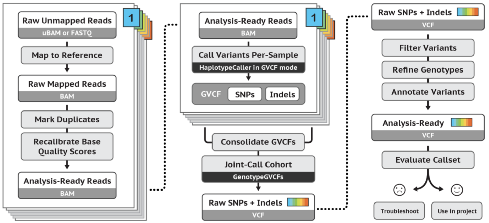

This pipeline can be run from the first tab **Variant discovery**.
The page consists of an input box to the left and two output boxes to the right.

### Input

An experiment name needs to be provided which is used for unique file name generation of output files.  

There are two workflows available. Both pipelines follow the **GATK best practice** instruction for germline short variant discovery. The main difference is in the inclusion of **base quality score recalibration** (GQSR). The other minor difference is in the calling order for **duplicates marking** and **read group processing**. The GATK best practice pipeline is more resource intensive and requires longer to complete. Results from both pipelines do not significantly differ.



_Visual representation of the pipeline. The tools named on pages are used on each sample individually._
_Tools named outside are used on samples combined._
(Source: [GATK](https://gatk.broadinstitute.org/hc/en-us/articles/360035535932-Germline-short-variant-discovery-SNPs-Indels-))

The **optional process**are the ones that can be skipped or included in a pipeline. Note that this is not the same as **Pipeline steps**. If the optional steps are unmarked the pipeline will skip this step by providing the given tools inputs to the next tool. For example skipping the trimming can be achieved by unmarking it from the optional process but leaving it market in processes steps. If we were to unmark it in the processes steps the pipeline would understand it as that the trimming has already been done but we wish to skip it in this run. So the next tool will search for the trimmed sequences.

The **reference** files appear automatically after insertion in the folder. At most a page refresh is required.

**Advanced options** can be toggled on or off for further customization of the pipeline. For in detail description of parameters and tools functionalities please refer to the referral links provided for each tool below.

The steps in **pipeline includes** should be exclusively used for skipping when running a failed pipeline again. The process will fail if a tool can not locate its input file.

### Output boxes

In the **progress report** the time and the information about the outcome of each tool will be printed. Therefore the prime purpose of this display is the tracking of pipeline steps.

The standard output of each tool will be printed inside the **Standard output** box. Therefore the prime purpose of this display is in detail tracking of tools or debugging a failed status observed in the progress report.


### Tools

#### FastQC

FastQC aims to provide a simple way to do some quality control checks on raw sequence data coming from high throughput
sequencing pipelines. It provides a modular set of analyses which you can use to give a quick impression of whether your
data has any problems of which you should be aware before doing any further analysis
([source](http://www.bioinformatics.babraham.ac.uk/projects/fastqc/)).

FastQC can be run before trimming and after trimming. The following [manual](https://dnacore.missouri.edu/PDF/FastQC_Manual.pdf)
can help with the understanding of the output report.

#### BBduk

This is the software that is used for input sequence trimming. Trimming is an optional step and can be avoided by deselecting it.
In detail description about the tool can be found [here](https://dnacore.missouri.edu/PDF/FastQC_Manual.pdf).  
For questions about advanced options reference the [man-page](https://manpages.debian.org/testing/bbmap/bbduk.sh.1.en.html).

Single-end:  
```
bbduk.sh in={input1} out={trimmed} ref={adapters} ktrim={ktrim} qtrim={qtrim}  
trimq={trimq} overwrite=true k={k} mink={mink} hdist={hdist} tpe tbo ftm={ftm} chastityfilter={chastityfilter}  
minlen={minlen} threads={n_cores}
```  

Paired-end:  
```
bbduk.sh in={input1} in2={input2} out={trimmed} out2={trimmed2} ref={adapters} ktrim={ktrim} qtrim={qtrim}  
trimq={trimq} overwrite=true k={k} mink={mink} hdist={hdist} tpe tbo ftm={ftm} chastityfilter={chastityfilter}  
minlen={minlen} threads={n_cores}
```

#### Burrows-Wheeler Aligner (BWA)

**BWA-MEM** is used to align sample sequences to the reference genome. Separate variants are performed if sequences
are _single-end_ or _pair-end_. For more details reference [man pages](http://bio-bwa.sourceforge.net/bwa.shtml).

Single-end:  
`bwa mem -t {core} -M {reference} {input1}`  
Paired-end:  
`bwa mem -t {core} -M {reference} {input1} {input2}`

#### Mapping duplicates

Picards **MarkDuplicates** is used to locate and tag duplicate reads in alignment ( _BAM_ ) file,
where duplicate reads are defined as originating from a single fragment of DNA. Further information can be found
[here](https://gatk.broadinstitute.org/hc/en-us/articles/360037052812-MarkDuplicates-Picard-)

`java -jar usr/picard/picard.jar MarkDuplicates INPUT={in1} OUTPUT={out} METRICS_FILE={out_duplicated_metric}`

#### Read groups

Picards **AddOrReplaceReadGroups** is used to assign all the reads in a file to a single new read-group.
Further information can be found
[here](https://gatk.broadinstitute.org/hc/en-us/articles/360037226472-AddOrReplaceReadGroups-Picard-).

`java -jar ../usr/picard/picard.jar AddOrReplaceReadGroups INPUT={in1} OUTPUT={out} RGSM={sample} RGPU=none RGLB={ref_organism} RGPL=ILLUMINA`

#### Base recalibration

This is done in two steps. Fist GATKs **BaseRecalibrator** is used to generate a recalibration 
table based on various covariates. The default covariates are read group, reported quality score, machine cycle, and nucleotide context. 
Further information can be found
[here](https://gatk.broadinstitute.org/hc/en-us/articles/360036898312-BaseRecalibrator).

`java -jar {self.gatk} BaseRecalibrator -R {ref_fasta} -I {bam} --use-original-qualities -known-sites {ref_vcf} -O {bqsr_recal_table}`

In the second step GATKs **ApplyBQSR** is used to recalibrate the base qualities of the input reads based
 on the recalibration table produced by the BaseRecalibrator tool, and output a recalibrated BAM file.
 Further information can be found
[here](https://gatk.broadinstitute.org/hc/en-us/articles/360037055712-ApplyBQSR).

`java -jar {self.gatk} ApplyBQSR --add-output-sam-program-record -R {ref_fasta} -I {bam} --use-original-qualities --bqsr-recal-file {bqsr_recal_table} -O {out}`

#### Variant calling

GATKs **HaplotypeCaller** is used to call germline SNPs and indels via local re-assembly of haplotypes.
Further information can be found
[here](https://gatk.broadinstitute.org/hc/en-us/articles/360037225632-HaplotypeCaller).

`java -jar {self.gatk} HaplotypeCaller -R {reference} -I {in1} -O {out} -ploidy {ploidy} -stand-call-conf {confidence}`

Confidence can be set in advance tool options.

#### Merging VCF files

GATKs **CombineGVCFs** is used to combine per-sample gVCF files produced by HaplotypeCaller into a multi-sample gVCF file.
Further information can be found
[here](https://gatk.broadinstitute.org/hc/en-us/articles/360037053272-CombineGVCFs).

`java -jar {self.gatk} CombineGVCFs -V {input_comand} -R {reference} -O {out_merged}`

#### Variant selection

GATKs **SelectVariants** makes it possible to select a subset of variants based on various criteria in 
order to facilitate certain analyses. Here is it used for selection of **SNPs**.
Further information can be found
[here](https://gatk.broadinstitute.org/hc/en-us/articles/360037055952-SelectVariants).

`java -jar {self.gatk} SelectVariants -R {reference} -V {in1} -O {out} --select-type-to-include SNP'`

#### Variants to table

GATKs **VariantsToTable** is used to extract fields from a VCF file to a tab-delimited table.
Further information can be found
[here](https://gatk.broadinstitute.org/hc/en-us/articles/360036896892-VariantsToTable).

`java -jar {self.gatk} VariantsToTable -V {in1} -F CHROM -F POS -F REF -F ALT -GF DP -GF AD -GF GQ -GF PL -O {out}`
