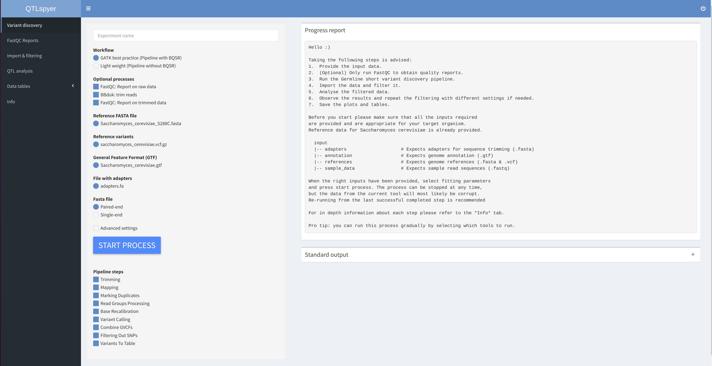
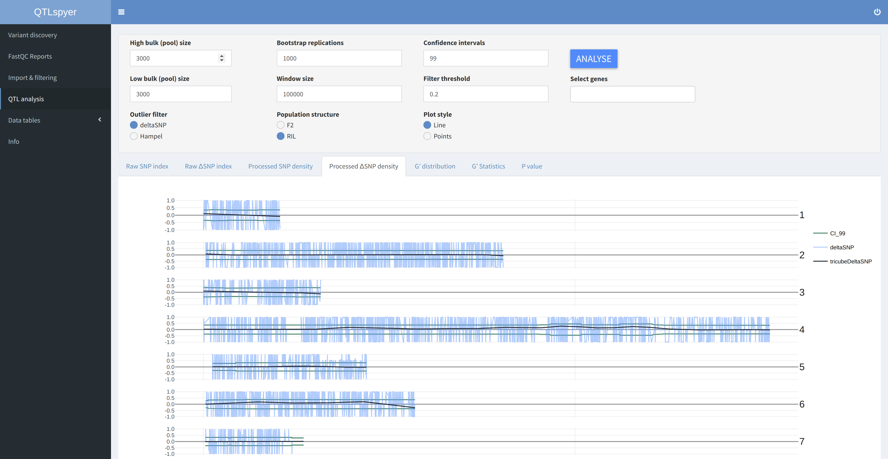

 

## Table of contents

> * [QTLspyer](#qtlspyer)
>   * [Table of contents](#table-of-contents)
>   * [About](#about)
>   * [Installation](#installation)
>     * [Windows](#windows)
>     * [Linux](#linux)
>     * [Advanced](#advanced)
>   * [Usage](#usage)
>     * [Screenshots](#screenshots)
>   * [Code](#code)
>     * [Content](#content)
>     * [Folder structure](#folder-structure)
>     * [Requirements and limitations](#requirements-and-limitations)
>   * [Resources](#resources)
>   * [License](#license)

## About

This application was created as my master thesis project. Its goal is to make a **QTL bulk** analysis using NGS data faster, repeatable and easier for the user. This is achieved by using a `python` script which connects **GATK** tools into a customizable pipeline. A `R Shiny` app allows for easy pipeline customization, data filtration and result visualization. To spare the users from all the installation steps of tools and dependencies the whole project is available in form of a Docker image. To simplify the installation process scripts for installing on **Windows 10** and **Linux** have been provided. All that the user is required to manually install is a **Docker** version compatible with his os.  
* Project status: **prototype**

Docker image:

* <https://hub.docker.com/repository/docker/hudogriz/qtl_spyer>

## Installation

The installation can be mainly done in two ways. First is save the right installation script inside a designated folder and run it. The second way is to copy this repository to a local computer and build the docker image using the command `docker build -t hudogriz/qtl_spyer:latest .` in the same directory as the `Dockerfile`. I recommend the first one as it is easier. Both steps require a pre-installed **Docker**.

### Windows

1. Install [**Docker Desktop**](https://hub.docker.com/editions/community/docker-ce-desktop-windows) for Windows.  
2. Create a designated folder _(recommended: Use lower cases for name and create it at C:)_.  
3. Download `Run_qtlspyer_on_windows10.bat` from [here](https://raw.githubusercontent.com/HudoGriz/QTLspyer/main/Run_qtlspyer_on_windows10.bat)
4. Place `Run_qtlspyer_on_windows10.bat` into the created folder.  
5. Run `Run_qtlspyer_on_windows10.bat` as **Administrator**.

### Linux

1. Install [**Docker**](https://docs.docker.com/engine/install/ubuntu/) for Linux.  
2. Create a designated folder.  
3. Download `Run_qtlspyer_on_linux.sh` from [here](https://raw.githubusercontent.com/HudoGriz/QTLspyer/main/Run_qtlspyer_on_linux.sh).   
4. Make script executable with `chmod +x Run_qtlspyer_on_linux.sh`.  
5. Run `Run_qtlspyer_on_linux.sh`.  

### Advanced

1. Download **zip** or pull repository to local with `git clone git@github.com:HudoGriz/QTLspyer.git`.  
2. Build **Docker image** `docker build -t hudogriz/qtl_spyer:latest .` from the location of the `Dockerfile`.  
3. Lunch the **container** with `docker run -d --rm -p 3838:3838 --name qtl_spy -v $(pwd)/QTLspyer/:/QTLspyer hudogriz/qtl_spyer:latest`.  
4. _(Optional)_ For Windows use `docker run -d --rm -p 3838:3838 --name qtl_spy -v %~dp0\QTLspyer\:\QTLspyer hudogriz/qtl_spyer:latest`.  
5. Redirect your browser to `localhost:3838`.  

## Usage

The main use of the app is to run the **GATK** - _Germline short variant discovery_ pipeline using a _GUI_. Further functionalities allow for viewing of **fastQC** reports, variant data filtration and visualization. Interactive data filtration is achieved by four histograms visualizing the cumulative data distribution changes. The **QTL**s estimations are based on [QTLseqr](https://github.com/bmansfeld/QTLseqr) a `library` for **R**. Two prime methods are used for **QTL** estimation: [QTL-seq method](https://onlinelibrary.wiley.com/doi/full/10.1111/tpj.12105) and [G prime method](https://journals.plos.org/ploscompbiol/article?id=10.1371/journal.pcbi.1002255). The data is visualized with interactive plots depicting variables vs. genome position. The addition of a `.gvc` enables the plotting of gene locations. Data tables containing statistics about individual **SNP**s and **QTL**s can be viewed and downloaded. In detail information about the process and users recommended action can also be found inside the **Shiny** app.

### Screenshots

<i>Side menu for selection of app functionalities. </i>
  
  

<i>Control panel that allows for customization of the variant calling pipeline. </i>
  
  

<i>Panel where FastQC reports can be viewed in new browser windows. </i>
  
  

<i>Panel with filter parameters selection and filtering feedback data. </i>
  
  

<i>Panel for running QTL estimations and observing the results. </i>
  
  

<i>Panel with the results. </i>
  
  

## Code

### Content

The code is organized into two parts. The first part is in `python`. A `class` object is created which methods call the required tool and evaluate the output. These methods are used to code a pipeline which is saved as an executable python script. The shiny app is used to create the appropriate command line for running the executable script. Active watchers observe changes in the log files and report back on the pipeline progression.

### Folder structure

    QTLspyer                            # Root project folder                   
    ├── shiny                           # Code for the R shiny application
    ├── variant_calling                 # Python scripts for variant calling pipeline
    ├── log                             # Process status reports and standard outputs from tools
    ├── input
    │   ├── adapters                    # Expects adapters for sequence trimming (.fasta)
    │   ├── annotation                  # Expects genome annotation (.gtf)
    │   ├── references                  # Expects genome references (.fasta & .vcf)
    │   └── sample_data                 # Expects sample read sequences (.fastq)
    └── output
        ├── aligned                     # Sequence alignment files location (.bam)
        ├── fastqc                      # FastQC Quality reports location (.html & .zip)
        ├── trimmed                     # Trimmed read sequences location (.fasqc)
        └── GATK                        # GATK tools for variant calling output location
            ├── VCFs                    # Germline Variant called files and their indexes (.vcf & .tbi)
            ├── nonfiltered             # SNPs selected out of variants and their indexes (.vcf & .idx)
            └── tables                  # VCF files transformed to tables (.snps.table)

### Requirements and limitations

The variant calling pipeline is recurse intensive. The recommended specs are above 8GB of RAM. The minimum is 4GB. A CPU that allows multithreading is recommended. Benchmark processes with 1-3 GB `.fastq` samples took 2-4 hours on 32GB of RAM and 8 core processor. Samples between 5-10 GB can reach up to 15 hours. Make sure to have enough space on the hard drive. For every GB of input data we can expect on average 7 GB of output information.
 

## Resources

QTLseqr :
> Mansfeld B.N. and Grumet R, QTLseqr: An R package for bulk segregant
> analysis with next-generation sequencing *The Plant Genome*
> [doi:10.3835/plantgenome2018.01.0006](https://dl.sciencesocieties.org/publications/tpg/abstracts/11/2/180006)

QTL-seq method:
> Takagi, H., Abe, A., Yoshida, K., Kosugi, S., Natsume, S., Mitsuoka,
> C., Uemura, A., Utsushi, H., Tamiru, M., Takuno, S., Innan, H., Cano,
> L. M., Kamoun, S. and Terauchi, R. (2013), QTL-seq: rapid mapping of
> quantitative trait loci in rice by whole genome resequencing of DNA
> from two bulked populations. *Plant J*, 74: 174–183.
> [doi:10.1111/tpj.12105](https://onlinelibrary.wiley.com/doi/full/10.1111/tpj.12105)

G prime method:
> Magwene PM, Willis JH, Kelly JK (2011) The Statistics of Bulk
> Segregant Analysis Using Next Generation Sequencing. *PLOS
> Computational Biology* 7(11): e1002255.
> [doi.org/10.1371/journal.pcbi.1002255](http://journals.plos.org/ploscompbiol/article?id=10.1371/journal.pcbi.1002255)

GATK:
> Collins, R.L., Brand, H., Karczewski, K.J. et al. (2020)
> A structural variation reference for medical and population genetics.
> Nature 581, 444–451.
> [doi.org/10.1038/s41586-020-2287-8](https://doi.org/10.1038/s41586-020-2287-8)

> Werling, D.M., Brand, H., An, JY. et al. (2018)
> An analytical framework for whole-genome sequence association studies and 
> its implications for autism spectrum disorder. 
> Nat Genet 50, 727–736.
> [doi.org/10.1038/s41588-018-0107-y](https://doi.org/10.1038/s41588-018-0107-y)

FastQC:
> Andrews, S. (2010). 
> FastQC:  A Quality Control Tool for High Throughput Sequence Data. 
> Available online at: http://www.bioinformatics.babraham.ac.uk/projects/fastqc/

BWA:
> Li H. (2013) Aligning sequence reads, clone sequences and assembly contigs with BWA-MEM. 
> [arXiv:1303.3997v2](https://arxiv.org/abs/1303.3997) [q-bio.GN].

BBduk:
> Bushnell B. (2021) BBMap
> [sourceforge.net/projects/bbmap/](sourceforge.net/projects/bbmap/)

Picard:
> Broad Institute (2019)
> Broad Institute, [GitHub repository](http://broadinstitute.github.io/picard/)

SAMtools:
> Heng Li, Bob Handsaker, Alec Wysoker, Tim Fennell, Jue Ruan, Nils Homer, Gabor Marth, 
> Goncalo Abecasis, Richard Durbin, 1000 Genome Project Data Processing Subgroup, 
> The Sequence Alignment/Map format and SAMtools, 
> Bioinformatics, Volume 25, Issue 16, 15 August 2009, Pages 2078–2079, https://doi.org/10.1093/bioinformatics/btp352

Python:
> Python Software Foundation. Python Language Reference, version 3.8. Available at http://www.python.org  
> Packages used: os, json, plumbum.

R:
> R Core Team (2017). 
> R: A language and environment for statistical computing. 
> R Foundation for Statistical Computing, Vienna, Austria. URL https://www.R-project.org/  
> Packages used: shiny, shinydashboard, plotly, DT, shinyWidgets, QTLseqr, ggplot2, shinycssloaders, htmlwidgets, randomcoloR, shinyBS, markdown, rtracklayer.

Docker:
> Merkel, D. (2014). 
> Docker: lightweight linux containers for consistent development and deployment. 
> Linux Journal, 2014(239), 2.

Thanks:
> Special thanks to [Genialis](https://www.genialis.com/) for [resolwebio/rnaseq](https://hub.docker.com/r/resolwebio/rnaseq) and cooperation in this project.  
> To my mentors [Assist. Prof. Dr. Cene Gostinčar](https://scholar.google.com/citations?user=D82dKecAAAAJ&hl=en) and [Dr. Janez Kokosar](https://github.com/jkokosar).  
> To [Dr. Roman Luštrik](https://github.com/romunov) for his help with technical matters.  
> (TODO)

## License

[MIT License](https://opensource.org/licenses/MIT)
