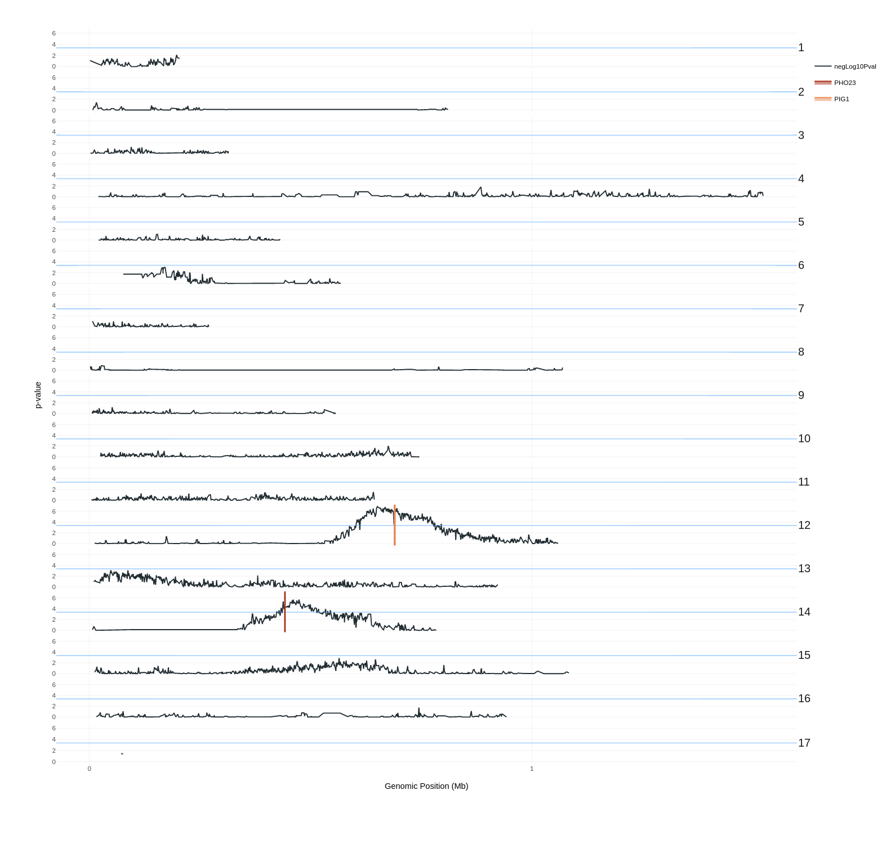

 

## Table of contents

> * [QTLspyer](#qtlspyer)
>   * [Table of contents](#table-of-contents)
>   * [About](#about)
>   * [How to build](#how-to-build)
>     * [Windows](#windows)
>     * [Linux](#linux)
>     * [Advanced](#advanced)
>   * [Screenshots](#screenshots)
>   * [Code](#code)
>     * [Content](#content)
>     * [Folder structure](#folder-structure)
>   * [Requirements and limitations](#requirements-and-limitations)
>   * [Resources](#resources)
>   * [License](#license)

## About

 For our goal to simplify the detection of quantitative trait loci (QTL) with the use of WGS data based on the bulk segregant analysis (BSA) method, we developed a software tool named **QTLspyer**. We designed a user-friendly graphical interface using `R shiny`. The QTL detection process was divided into _variant calling_ and _QTL finding_. In the first step, a `Python` script is used to call _single nucleotide variants_ (SNVs) with the **Genome Analysis Toolkit** (GATK). In the second step, the probabilities of potential QTL findings are estimated based on the [G' method](https://journals.plos.org/ploscompbiol/article?id=10.1371/journal.pcbi.1002255) and [QTL-seq method](https://onlinelibrary.wiley.com/doi/full/10.1111/tpj.12105) approach using an `R library` called [QTLseqr](https://github.com/bmansfeld/QTLseqr). Results are presented to the user as data tables of SNPs and QTLs statistical properties and graphically with plots showing QTL probabilities for all genome positions. The application together with all required tools is contained inside a **Docker image**. We demonstrated the accuracy of the used approach with the re-analysis of datasets from published studies.

## How to build

The app can mainly be build using two methods. The first method is to save and execute the appropriate script inside the designated folder. The second method is to clone this repository to a local computer and build the docker image using the command `docker build -t hudogriz/qtl_spyer:latest .`. The command should be executed at the same location as the `Dockerfile`. We recommend the first method. Both methods require **Docker**.

To simplify the process, scripts for starting the app on **Windows 10** and **Linux** have been provided.

### Windows

1. _(Optional)_ Install [**Docker Desktop**](https://hub.docker.com/editions/community/docker-ce-desktop-windows) for Windows.  
2. Create a designated folder _(recommended: Use lower cases for the name and create it at C:)_.  
3. Download `Run_qtlspyer_on_windows10.bat` from [here](https://raw.githubusercontent.com/HudoGriz/QTLspyer/main/Run_qtlspyer_on_windows10.bat)
4. Place `Run_qtlspyer_on_windows10.bat` into the created folder.  
5. Run `Run_qtlspyer_on_windows10.bat` as a **Administrator**.
6. _(Optional)_ Redirect your internet browser to [localhost:3838](http://localhost:3838/).

### Linux

1. _(Optional)_ Install [**Docker**](https://docs.docker.com/engine/install/ubuntu/) for Linux.  
2. Create a designated folder.  
3. Download `Run_qtlspyer_on_linux.sh` from [here](https://raw.githubusercontent.com/HudoGriz/QTLspyer/main/Run_qtlspyer_on_linux.sh).   
4. Make the script executable with `chmod +x Run_qtlspyer_on_linux.sh`.  
5. Run `Run_qtlspyer_on_linux.sh`.
6. _(Optional)_ Redirect your internet browser to [localhost:3838](http://localhost:3838/).

### Advanced

1. Download **zip** or pull the repository with `git clone git@github.com:HudoGriz/QTLspyer.git`.  
2. Build the **Docker image** with `docker build -t hudogriz/qtl_spyer:latest .`.  
3. Lunch the **container** with `docker run -d --rm --init -p 3838:3838 --name qtl_spy -v $(pwd)/QTLspyer/:/QTLspyer hudogriz/qtl_spyer:latest`.  
4. _(Optional)_ For Windows use `docker run -d --rm --init -p 3838:3838 --name qtl_spy -v %~dp0\QTLspyer\:\QTLspyer hudogriz/qtl_spyer:latest`.  
5. Redirect your browser to [localhost:3838](http://localhost:3838/).  

Docker image:

* <https://hub.docker.com/repository/docker/hudogriz/qtl_spyer>

## Screenshots

<i>The side menu enables switching between the app tabs. </i>
  
  

<i>Tab for customization and execution of the variant calling pipelines. </i>
  
  

<i>Tab where created FastQC reports can be viewed. </i>
  
  

<i>Tab for filtering SNPs. </i>
  
  

<i>Tab for running QTL estimations. Below, the results are presented as interactive plots. </i>
  
  

<i>Tables with numerical results. </i>
  
  

<i>Plot showing p-values for genome positions per chromosome. The reference data is from a QTL study done on yeast by Pačnik et al. (2021). </i>
  
  

## Code

### Content

The app consist of `Python` and `R` code. The _variant calling_ pipelines are created using `Python`. The command lines for running the boinfromatics tools are defined as `methods` inside a `class`.

### Folder structure

    QTLspyer                            # Root project folder                   
    ├── shiny                           # Code for the R shiny application
    ├── variant_calling                 # Python scripts for variant calling pipeline
    ├── log                             # Process status reports and standard outputs from tools
    ├── input
    │   ├── adapters                    # Expects adapters for sequence trimming (.fasta)
    │   ├── annotation                  # Expects genome annotation (.gtf)
    │   ├── references                  # Expects genome references (.fasta & .vcf)
    │   └── sample_data                 # Expects sample read sequences (.fastq)
    └── output                          # Output files
        ├── aligned                     # Aligned sequences (.bam)
        ├── fastqc                      # FastQC Quality reports (.html & .zip)
        ├── trimmed                     # Trimmed read sequences (.fasqc)
        └── GATK                        # Output of GATK tools
            ├── VCFs                    # Germline Variant files and their indexes (.vcf & .tbi)
            ├── nonfiltered             # Unfiltered SNPs selected out of variants and their indexes (.vcf & .idx)
            └── tables                  # VCF files transformed to tables (.snps.table)

## Requirements and limitations

The most intensive step is the execution of the variant calling pipeline. The recommended specs are above 8GB of RAM. The minimum is 4GB. A CPU that allows multithreading is recommended. Benchmarking was performed on a computer with 32GB of RAM and a Intel i7 CPU (3.60Hz & 8 threads). Processing 1-3 GB `.fastq` samples took 2-4 hours. Samples between 5-10 GB can reach up to 15 hours. Make sure to have enough space on the hard drive. For every GB of input data we can expect on average 7 GB of output data.
 

## Resources

QTLseqr :
> Mansfeld B.N. and Grumet R, QTLseqr: An R package for bulk segregant
> analysis with next-generation sequencing *The Plant Genome*
> [doi:10.3835/plantgenome2018.01.0006](https://dl.sciencesocieties.org/publications/tpg/abstracts/11/2/180006)

QTL-seq method:
> Takagi, H., Abe, A., Yoshida, K., Kosugi, S., Natsume, S., Mitsuoka,
> C., Uemura, A., Utsushi, H., Tamiru, M., Takuno, S., Innan, H., Cano,
> L. M., Kamoun, S. and Terauchi, R. (2013), QTL-seq: rapid mapping of
> quantitative trait loci in rice by whole genome resequencing of DNA
> from two bulked populations. *Plant J*, 74: 174–183.
> [doi:10.1111/tpj.12105](https://onlinelibrary.wiley.com/doi/full/10.1111/tpj.12105)

G prime method:
> Magwene PM, Willis JH, Kelly JK (2011) The Statistics of Bulk
> Segregant Analysis Using Next Generation Sequencing. *PLOS
> Computational Biology* 7(11): e1002255.
> [doi.org/10.1371/journal.pcbi.1002255](http://journals.plos.org/ploscompbiol/article?id=10.1371/journal.pcbi.1002255)

GATK:
> McKenna A., Hanna M., Banks E., Sivachenko A., Cibulskis K., Kernytsky A., Garimella K., Altshuler D., Gabriel S., Daly M., DePristo MA. (2010)
> The Genome Analysis Toolkit: a MapReduce framework for analyzing next-generation DNA sequencing data.
> Genome Res, 20:1297-303.
> [doi.org/10.1101/gr.107524.110](https://doi.org/10.1101/gr.107524.110)

FastQC:
> Andrews, S. (2010). 
> FastQC:  A Quality Control Tool for High Throughput Sequence Data. 
> Available online at: http://www.bioinformatics.babraham.ac.uk/projects/fastqc/

BWA:
> Li H. (2013) Aligning sequence reads, clone sequences and assembly contigs with BWA-MEM. 
> [arXiv:1303.3997v2](https://arxiv.org/abs/1303.3997) [q-bio.GN].

BBduk:
> Bushnell B. (2021) BBMap
> [sourceforge.net/projects/bbmap/](sourceforge.net/projects/bbmap/)

Picard:
> Broad Institute (2019)
> Broad Institute, [GitHub repository](http://broadinstitute.github.io/picard/)

SAMtools:
> Heng Li, Bob Handsaker, Alec Wysoker, Tim Fennell, Jue Ruan, Nils Homer, Gabor Marth, 
> Goncalo Abecasis, Richard Durbin, 1000 Genome Project Data Processing Subgroup, 
> The Sequence Alignment/Map format and SAMtools, 
> Bioinformatics, Volume 25, Issue 16, 15 August 2009, Pages 2078–2079, https://doi.org/10.1093/bioinformatics/btp352

Python:
> Python Software Foundation. Python Language Reference, version 3.8. Available at http://www.python.org  
> Packages used: os, json, plumbum.

R:
> R Core Team (2017). 
> R: A language and environment for statistical computing. 
> R Foundation for Statistical Computing, Vienna, Austria. URL https://www.R-project.org/  
> Packages used: shiny, shinydashboard, plotly, DT, shinyWidgets, QTLseqr, ggplot2, shinycssloaders, htmlwidgets, randomcoloR, shinyBS, markdown, rtracklayer.

Docker:
> Merkel, D. (2014). 
> Docker: lightweight linux containers for consistent development and deployment. 
> Linux Journal, 2014(239), 2.

Reference study:
> Pačnik K., Ogrizović M., Diepold M., Eisenberg T., Žganjar M., Žun G., Kužnik B., Gostinčar C., Curk T., Petrovič U., Natter K. (2021)
> Identification of novel genes involved in neutral lipid storage by quantitative trait loci analysis of Saccharomyces cerevisiae.
> BMC Genomics, 22, 1: 110.
> [doi.org/10.1186/s12864-021-07417-4](http://doi.org/10.1186/s12864-021-07417-4)

Thanks:
> To my mentors [Assist. Prof. Dr. Cene Gostinčar](https://scholar.google.com/citations?user=D82dKecAAAAJ&hl=en) and [Dr. Janez Kokosar](https://github.com/jkokosar).  
> To [Prof. Dr. Uroš Petrovič](https://scholar.google.com/citations?hl=en&user=dWCi8bAAAAAJ&view_op=list_works&sortby=pubdate) for guidance.  
> To [Dr. Roman Luštrik](https://github.com/romunov) for his help with technical matters.  
> To Ana Markež for being a persistent alpha tester.  

> Special thanks to [Genialis](https://www.genialis.com/) for [resolwebio/rnaseq](https://hub.docker.com/r/resolwebio/rnaseq) and cooperation in this project.  

## License

[MIT License](https://opensource.org/licenses/MIT)
